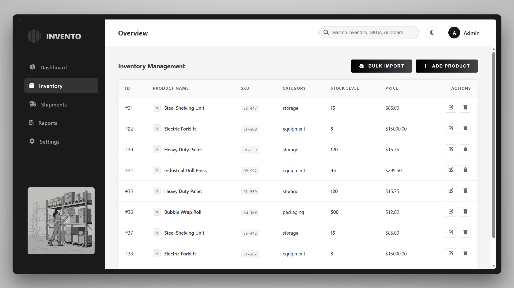

# Full-Stack Inventory Management System

A modernized, monochromatic logistics and inventory management system powered by a fully fledged REST API backend. This project showcases a clean, professional approach to supply chain visualization and data persistence.

## 🔗 Live Project
**[View Live Demo]([https://papia-inventory-system.vercel.app](https://inventory-management-g6y4.onrender.com))**

## 🖼️ System Preview

*Figure: The minimalist dashboard showing real-time stock analytics and inventory controls.*

## 🚀 Key Features
* **Monochromatic UI:** A high-contrast, professional design optimized for focus and reduced eye strain.
* **RESTful API:** Robust backend handling GET, POST, and UPDATE requests for inventory synchronization.
* **Automated DB Initialization:** Powered by SQLite; the system automatically builds the schema and seeds initial data on the first run.
* **Enterprise Authentication:** A secure login gate for system administrators.

## 🛠️ Tech Stack
* **Frontend:** HTML5, CSS3 (Custom Logistics Styling), Client-side JavaScript.
* **Backend:** Node.js, Express.js.
* **Database:** SQLite3 (Local file-based persistence).

## 🔐 Credentials & Security

To access the administrative dashboard, use the following default credentials:

* **Username:** `admin`
* **Password:** `admin123`

> [!WARNING]  
> **Change your password immediately** after the first login to ensure the security of your inventory data.

## ⚙️ Setup & Initialization

1.  **Install Dependencies** Navigate to the project root and install the required modules:
    ```bash
    npm install
    ```

2.  **Run the Server** Start the Node.js backend:
    ```bash
    node server.js
    ```

3.  **Access the App** Open your browser and navigate to:
    ```
    http://localhost:3000
    ```

## 📂 Project Structure
* `/public`: Frontend assets (HTML, CSS, JS).
* `/data`: SQLite database storage.
* `server.js`: Express.js API and server logic.
* `database.js`: Database schema and initialization script.

---
*Developed by Papia Karmakar — B.Tech CSE, UEM Kolkata*
